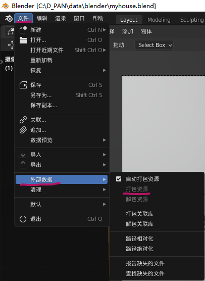
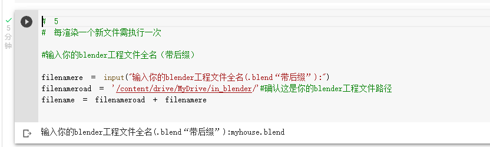

# Render Blender in google colab

Render Blender in google colab.ipynb
👇👇👇👇👇👇👇👇👇👇👇👇👇👇👇👇👇
https://www.aliyundrive.com/s/3douZqNkK14

* [google colab](https://colab.research.google.com)
* [google drive](https://drive.google.com/)

### 注：方案需全程在✈fanqiang的环境下进行！
### 先说缺点：这里的白嫖并不是无穷无尽的，而是看colab的空闲后端gpu情况，具体可查看colab官方文档，要是有能力可以去colab开colab pro，能得到一个更强大的云端训练环境。（一般都能用）
* [google colab官方说明文档](https://research.google.com/colaboratory/faq.html)

#### 介绍
简单的方式借用（嫖）google colab 的免费gpu来渲染自己的blender文件！
从此解放自己的gpu！

#### 创库原由
作为blender兴趣爱好者，苦于电脑配置低渲染慢而烦恼，在网上冲浪看到了YouTube上有许多blender云渲染的方法，例如：[Micro Singularity](https://youtu.be/A8FiCPUEv9Q)的教程，本方案就是在此基础上修改优化的。除了这个方法国内也有人在b站等平台发布过教程，也可以选择其他方案，适合自己的方案才是最好的。

#### 方案原理
借用[google colab](https://colab.research.google.com)的免费GPU来在线渲染。

#### colab介绍
什么是 Colab？
借助 Colaboratory（简称 Colab），您可在浏览器中编写和执行 Python 代码，并且：
* 无需任何配置
* 免费使用 GPU
* 轻松共享
它尤其适合机器学习、数据分析和教育目的。 从技术上来说，Colab 是一种托管式Jupyter 笔记本服务。

#### 使用前准备环境
* 1，谷歌云盘
* 2，浏览器
* 3，你的打包好的blender工程文件
* 4，渲染调用脚本

#### 使用步骤
##### 1. **打包**blender工程文件。
***

***
##### 2. 浏览器(我用的是edge，理论上chrome等都可运行)**登录自己的谷歌云盘**并**上传渲染脚本**并**用Google colab打开脚本**。

***

***

***

***

***
##### 3.  打开脚本后第一步直**接执行第一框代码``#1``**，看被分配后端gpu的型号，如果是和图一样是**k80**，则继续跟着教程走就好，如果与图不符而显示是**t4**，则可直接**跳过这一步**，后续会解释为什么不用k80。

***

***

***
可以看到已经终止了后端，状态已经变成重新连接，这时候只需要重新执行第一框代码``#1``即可，反复步骤得到t4即可

***
看到获取到**t4**，就证明你成功了！如果获取不到，可以过一段时间再试，一般试了10次获取不到，就是colab没有被你嫖得t4-gpu了，可以先去做些其他事情，5分钟后再试试

***
##### 4. 如果你到这一步了，**恭喜你**! 已经前路无阻了，下面只需要依次执行代码就行了！

执行第二框代``#2``，提示连接你的Google云盘到colab，等待代码执行完成

执行第三框代码``#3``，等待代码执行完成即可执行下一框代码

执行第四框代码``#4``，等待代码执行完成

此时回到Google云盘，**刷新**，即可看到一个文件夹"in_blender",打开此文件夹，将你得blender工程文件上传进去。

我这里上传得blender工程文件名叫 **myhouse.blend** -------记住自己得blender工程文件名（带后缀）

执行第五代码框``#5``，看到让我们输入自己刚刚上传得blender工程文件名，我这里输入**myhouse.blend**，输入后记得**回车**！！！！！！！

##### 5.渲染！

代码框``#6``、``#7``分别是渲染**单帧图片**和**多帧动画**，执行代码时**输入帧位**就开始执行了！！

下图是我渲染第一帧的例子

可以看到开始渲染了！！！！耐心等待即可！！！！

下图是我渲染第一帧到第二帧的例子

##### 6.渲染完成后查看渲染完成的文件**out_blender**
看到渲染代码显示blender quit 证明已经渲染完成！
在Google云盘根目录里看到有文件夹**out_blender**，渲染完成的文件就在里面，快去看看自己的成果吧！！

##### 7.渲染完成后操作
注意！！！！！！！！！！！！！！！！！！！！！！！
渲染完成后需要自行关闭后端gpu，白嫖用户是**不允许**一直挂着后台的，不运行gpu时会检测，**一直无人使用gpu**但是**占用资源**会可能被**封禁**。
#### 5.Q&A

Q：能一直挂着一直渲染吗？不能的话最多可以渲染多久呢？万一渲染动画中断了怎么办？
A：不能无限的一直挂着。目前我测试最多是挂4个小时左右，4小时左右就会弹窗检验是否是机器人。渲染完一帧图是完全足够的，如果在渲染动画时中断了，可在out_blender文件夹中查看渲染到了第几帧，重新执行代码框#7，选定帧来渲染就好，比如我渲染到12帧中断，再次执行是选择起始帧12，结束帧**。
***
Q: 每个代码框是每次都要执行吗？不是又是怎么样的？
A: 
1. ``#1`` 每次重新打开脚本时就要运行此代码获取后端gpu，不然无法运行下列一系列渲染代码
2. ``#2`` 每次重新打开脚本时就要运行此代码来连接自己的Google云盘账户，只要输出显示为**Mounted at /content/drive**就行。

3. 代码框``#3``只需要执行一次，``#3``的目的是下载blender应用程序到Google云盘，在Google云盘里的名叫**blenderFile_Linux**的文件夹就是blender应用程序，如果出现错误，可将此文件夹整个删除，再次执行代码框``#3``即可。
4. ``#4`` 每次重新打开脚本时就要运行此代码,此代码解决not found问题。
5. ``#5`` 更换需要渲染的blender工程文件时需执行，此代码影响下面``#6#7``的渲染代码。
6. ``#6`` 渲染代码，渲染时执行。
7. ``#7`` 渲染代码，渲染时执行。